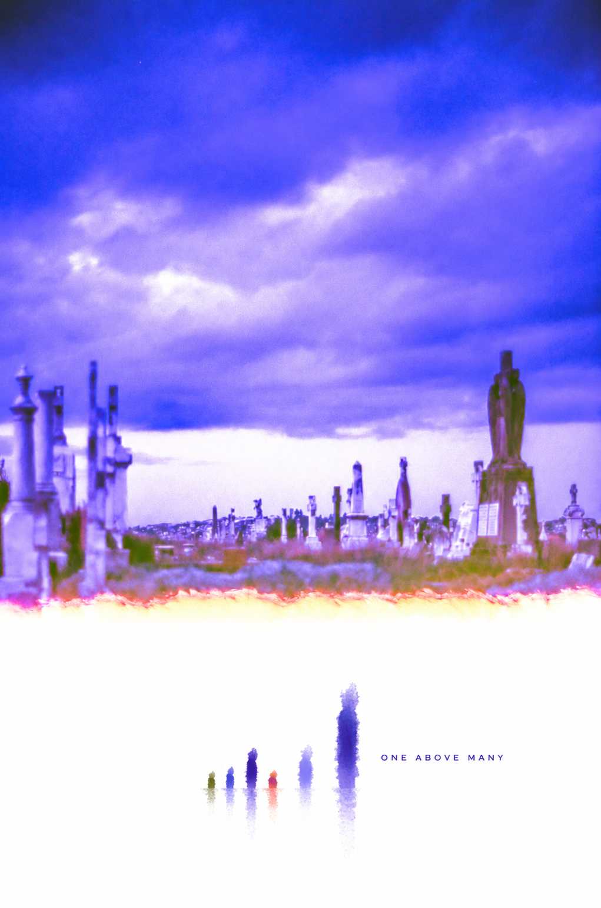
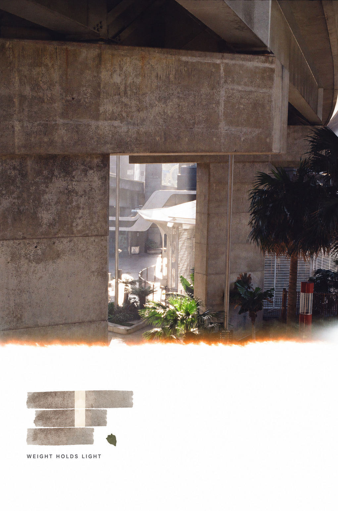
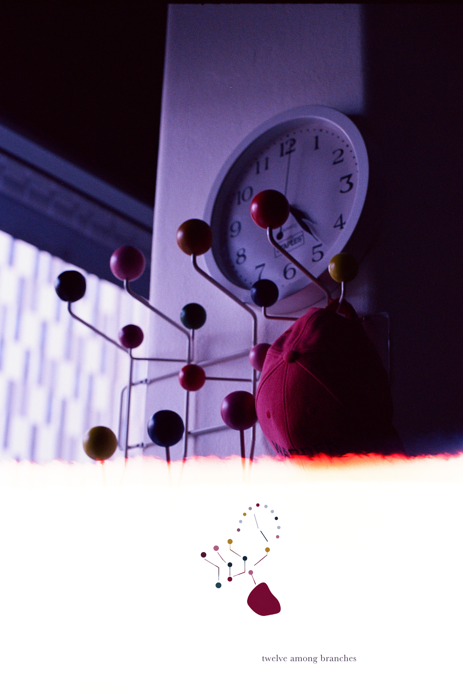

# Film Burn Abstract Editorial

English | [简体中文](README.zh-CN.md)

A Codex Skill that preserves accidental partially exposed film frames and turns only their genuine blank film into source-derived abstract editorial artwork.

> **Preserve the accident. Abstract the photograph into the remaining absence.**

## About

Partially exposed film can contain three materially different regions: a photograph, the accidental boundary where exposure ends, and genuinely blank film. This skill protects the first two and treats only the third as a possible creative canvas.

The blank area is not repaired, replaced, or automatically filled. Instead, the skill studies the photograph's relationships—scale, rhythm, direction, density, light, color, spacing, and tension—and derives a restrained abstract response for the available blank film.

**The photograph determines the artwork — not the other way around.**

## Example gallery

<table>
  <tr>
    <th>Cemetery</th>
    <th>Concrete</th>
    <th>Clock</th>
  </tr>
  <tr>
    <td valign="top"></td>
    <td valign="top"></td>
    <td valign="top"></td>
  </tr>
</table>

Examples demonstrate the workflow only; they must not be treated as reusable visual templates.

## What makes this different

This is not a film-burn generator or a preset visual style. It begins with an existing film accident and preserves it as evidence. Each photograph must produce its own abstract grammar, and recognizable objects should not simply become pictograms.

The skill may add one very short poetic phrase when the photograph supports it. The phrase remains source-specific, restrained, and secondary; it cannot manufacture an event or backstory.

> **Interpret relationships freely; invent facts never.**

## Core principles

| Region | Role |
|---|---|
| **Exposed photograph** | Protected source |
| **Original film-burn / exposure boundary** | Protected source |
| **Genuine blank / unexposed film** | Writable creative canvas |

- Preserve the original dimensions, full frame, and aspect ratio by default.
- Never crop, stretch, or resize merely to create more writable space.
- Do not generate, repair, strengthen, clean, or imitate a film burn.
- Do not extend or reconstruct the photographed scene.
- Derive a different abstract system from each photograph.
- Keep most of the writable film available as negative space when appropriate.
- Use text only when a convincing, visibly grounded phrase emerges.

## How it works

1. Identify the exposed photograph, original exposure boundary, and genuine blank film.
2. Stop if a meaningful writable region cannot be identified reliably.
3. Protect the photograph and boundary.
4. Select a small set of relationships that distinguish the photograph.
5. Translate those relationships into a minimal, source-specific abstract grammar.
6. Derive one short poetic fragment from the photograph's visible atmosphere or structure.
7. Composite generated elements only inside genuine blank film.
8. Validate source integrity, negative space, and creative specificity.

The complete operational behavior is defined by [SKILL.md](SKILL.md) and its English references.

## Installation

### A. Repository-scoped

Use this when the skill should be available only inside one project:

```text
your-project/
└── .codex/
    └── skills/
        └── film-burn-abstract-editorial/
            ├── SKILL.md
            └── references/
```

Copy `SKILL.md` and the `references/` directory from this repository into `.codex/skills/film-burn-abstract-editorial/` in your project.

### B. User-level

Use this when the skill should be available across your Codex projects:

```text
~/.agents/skills/film-burn-abstract-editorial/
```

Copy `SKILL.md` and the `references/` directory there. Start a new Codex task if the newly installed skill is not visible in an existing one.

These locations follow the current [official OpenAI guidance for repository- and user-scoped Codex skills](https://developers.openai.com/blog/eval-skills).

## Usage

Attach or place a partially exposed film scan in your project, then invoke the skill directly:

```text
Use $film-burn-abstract-editorial on this partially exposed film scan.
```

You do not need to repeat the skill's detailed creative or preservation instructions.

## Suitable input photographs

Good inputs contain:

- a meaningful exposed photograph;
- an original, distinguishable exposure boundary; and
- enough genuine blank or unexposed film to support a restrained intervention.

The blank region may appear above, below, beside, or irregularly around the photograph. Portrait and landscape frames are both supported.

## What the skill will refuse

The workflow should stop rather than:

- draw over a fully exposed photograph with no reliable writable region;
- invent blank film or a film-burn boundary;
- repair, redesign, dramatize, or decorate the accident;
- extend scenery, objects, light, or perspective into blank film;
- accept generic graphics or reusable phrase formulas unrelated to the source; or
- claim pixel-identical preservation when the available workflow cannot verify it.

## Repository structure

```text
.
├── README.md
├── README.zh-CN.md
├── LICENSE-NOTES.md
├── SKILL.md
├── references/
│   ├── source-derivation.md
│   ├── source-derivation.zh-CN.md
│   ├── visual-language.md
│   └── visual-language.zh-CN.md
└── assets/
    └── examples/
```

## Language and Chinese documentation

`SKILL.md` and the English reference files are the authoritative operational instructions. [README.zh-CN.md](README.zh-CN.md) and the `*.zh-CN.md` reference files are faithful Simplified Chinese documentation translations; they are not a separate operational version of the skill.

## Limitations

- Eligibility and writable-region identification depend on what can be established reliably from the supplied scan.
- An instruction-only skill cannot guarantee protected pixels remain identical unless the chosen generation and compositing workflow performs and reports that verification.
- Generative output may require iteration to pass both source-integrity and creative-specificity checks.
- Examples demonstrate the workflow only; they must not be treated as reusable visual templates.

## License and attribution

License selection is pending a provenance review. See [LICENSE-NOTES.md](LICENSE-NOTES.md). Until a license is added, do not assume permission to copy, modify, or redistribute the project or example imagery.

